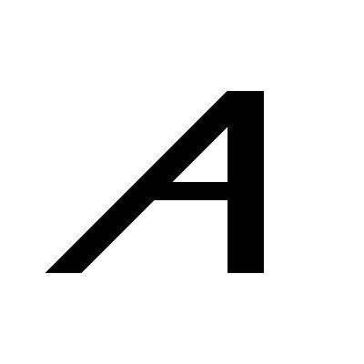

# Assignment 21 (Image processing)

---
# 1- Chess Board

# 2- Negative Images

# 3- Rotate Image

# 4- Remove Background (wolf)

# 5- Dead photo (Akhound)

# 6- Gradient

# 7- The first letter of my name

