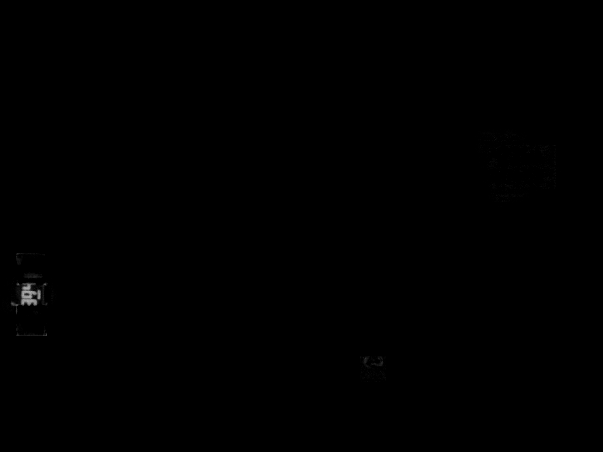
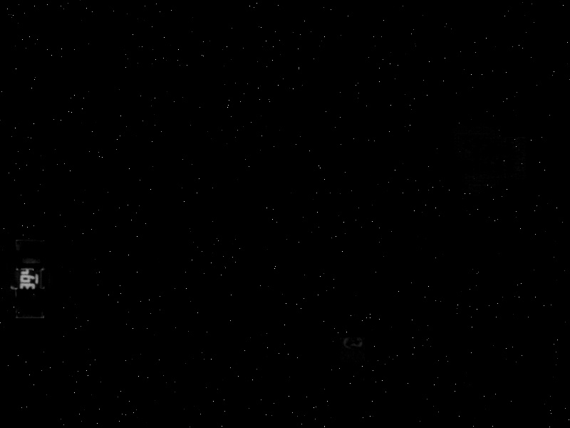

# Assignment 22, Image Processing

---
# 1- Password of pics

# 2- Black hole

# 3- Find difference of electronic boards

# 4- Highway

# 5- Merge faces

# 6- paint of my picture

# 7- Create noise

