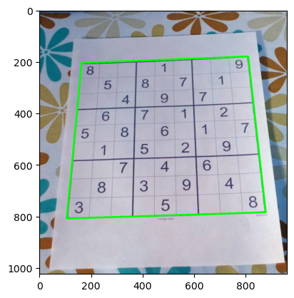
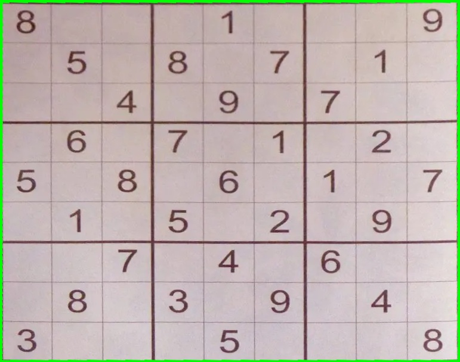
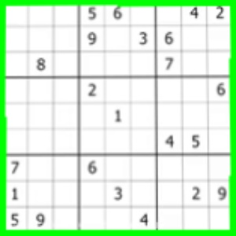

# Assignment 28
---

# Sudoku Detector

#### for help run:  python sudokuDetector.py --help
##### for run python file: sudokuDetector.py --input INPUT --filter_size FILTER_SIZE

# Live Sudoku Detector

#### for help run:  python sudokuDetector.py --help
##### for run python file: sudokuDetector.py --filter_size FILTER_SIZE

